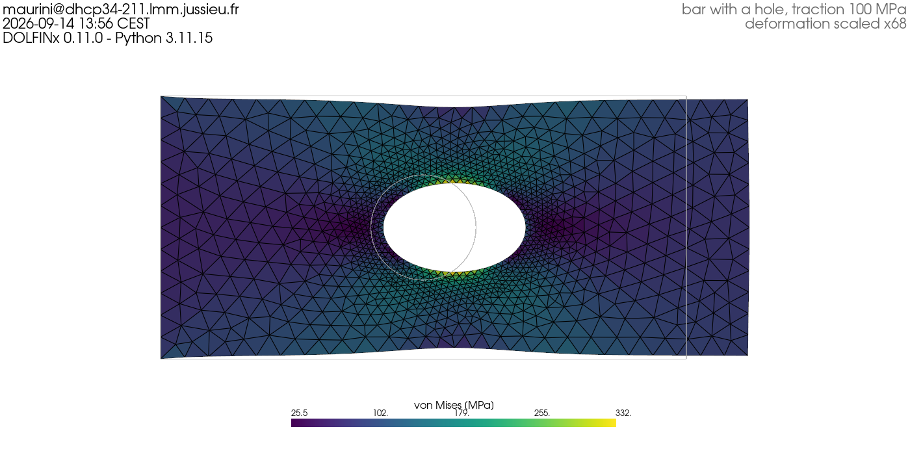

# Installing FEniCSx / DOLFINx 0.11

[](https://github.com/cmaurini/fenicsx-install/actions/workflows/test-install.yml)

Installation instructions and a self-test for the finite element library
[DOLFINx](https://github.com/FEniCS/dolfinx) **0.11.0**, used in the numerical
courses of the Solid Mechanics Master at Sorbonne Université.

Follow the guide for your operating system, then run the test script and send
the image it produces.

| Your machine | Guide | Method |
|---|---|---|
| Linux | [INSTALL-conda.md](INSTALL-conda.md) | conda |
| macOS (Intel or Apple Silicon) | [INSTALL-conda.md](INSTALL-conda.md) | conda |
| Windows | [INSTALL-windows.md](INSTALL-windows.md) | WSL2 + conda |

If something goes wrong, [TROUBLESHOOTING.md](TROUBLESHOOTING.md) lists the
errors students hit most often, with their fixes.

## What gets installed

`environment.yml` describes one conda environment, named `fenicsx-0.11`, used on
all three systems. Besides DOLFINx it contains gmsh (meshing), PyVista
(3-D visualisation), JupyterLab, and the usual scientific Python packages.

## Check your installation

From the root of this repository:

```bash
conda activate fenicsx-0.11
python elasticity.py
```

The script meshes a bar with a hole, solves a linear elasticity problem, and
writes two files to `output/`:

| File | What it is |
|---|---|
| `elasticity.xdmf` + `elasticity.h5` | displacement and stress fields, to open in ParaView |
| `elasticity.png` | the deformed bar, stamped with your machine name, user name and the date |

It ends with:

```
SUCCESS - your DOLFINx installation works.
```

**Send `output/elasticity.png` as proof that your installation works.** It should
look like this, but with your own name, machine and date in the corner:



The physics is a check too: the reported stress concentration factor `K_t` is
about 3.3, close to the textbook value of 3 for a circular hole in a plate under
uniform tension.

## Viewing the results

Open `output/elasticity.xdmf` in [ParaView](https://www.paraview.org/download/)
(installation covered in the guides above), select the `Xdmf3` reader when asked,
then apply a *Warp By Vector* filter on `displacement` to see the deformed shape
and colour it by `von_Mises`.

## Further resources

- [The DOLFINx tutorial](https://jsdokken.com/dolfinx-tutorial/) by Jørgen S. Dokken
- [FEniCS documentation](https://docs.fenicsproject.org/)
- [DOLFINx demos](https://docs.fenicsproject.org/dolfinx/v0.11.0/python/demos.html)

## License

MIT, see [LICENSE](LICENSE).
